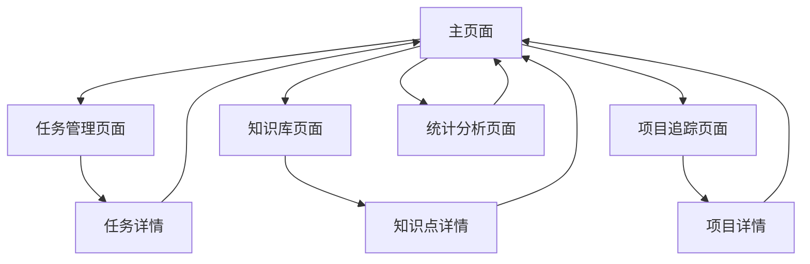

# 个人学习TodoList产品需求文档

## 1. Product Overview
个人学习TodoList是一个专为学习者设计的任务管理应用，帮助用户高效记录知识重点、追踪学习项目开发进度，提升学习效率和项目管理能力。
- 解决学习过程中知识点分散、项目进度难以追踪的问题，为个人学习者提供一站式的学习管理工具。
- 目标是成为学习者的个人学习助手，提高学习的系统性和效率。

## 2. Core Features

### 2.1 User Roles
本产品为个人使用工具，无需复杂的用户角色区分。

### 2.2 Feature Module
我们的个人学习TodoList包含以下主要页面：
1. **主页面**：任务概览、快速添加、统计面板
2. **任务管理页面**：任务列表、分类筛选、状态管理
3. **知识库页面**：知识点记录、标签管理、搜索功能
4. **项目追踪页面**：项目列表、进度可视化、里程碑管理
5. **统计分析页面**：学习数据、完成率分析、时间统计

### 2.3 Page Details

| Page Name | Module Name | Feature description |
|-----------|-------------|---------------------|
| 主页面 | 任务概览 | 显示今日任务、本周任务、紧急任务的快速预览 |
| 主页面 | 快速添加 | 提供快速添加任务、知识点、项目的入口 |
| 主页面 | 统计面板 | 展示学习进度、完成率、连续学习天数等关键指标 |
| 任务管理页面 | 任务列表 | 创建、编辑、删除任务，设置优先级、截止日期、分类标签 |
| 任务管理页面 | 分类筛选 | 按类型（学习、项目、复习）、状态、优先级筛选任务 |
| 任务管理页面 | 状态管理 | 标记任务完成状态、添加完成备注、设置重复任务 |
| 知识库页面 | 知识点记录 | 记录学习要点、添加笔记、关联相关资源链接 |
| 知识库页面 | 标签管理 | 为知识点添加标签、创建知识体系、建立知识关联 |
| 知识库页面 | 搜索功能 | 全文搜索知识点、按标签筛选、按时间排序 |
| 项目追踪页面 | 项目列表 | 创建学习项目、设置项目目标、分解项目任务 |
| 项目追踪页面 | 进度可视化 | 显示项目完成进度条、甘特图、时间线视图 |
| 项目追踪页面 | 里程碑管理 | 设置项目里程碑、记录重要节点、庆祝完成成就 |
| 统计分析页面 | 学习数据 | 展示每日学习时长、任务完成数量、知识点积累 |
| 统计分析页面 | 完成率分析 | 分析任务完成率趋势、识别学习瓶颈、优化建议 |
| 统计分析页面 | 时间统计 | 统计各类学习活动时间分配、效率分析报告 |

## 3. Core Process

**主要用户操作流程：**

1. **日常学习流程**：用户登录 → 查看今日任务 → 添加新任务/知识点 → 执行学习 → 标记完成 → 查看统计
2. **项目管理流程**：创建新项目 → 设置项目目标 → 分解任务 → 追踪进度 → 达成里程碑 → 项目完成
3. **知识管理流程**：学习新知识 → 记录知识点 → 添加标签 → 建立关联 → 复习巩固 → 知识应用

## 4. User Interface Design

### 4.1 Design Style
- **主色调**：深蓝色(#2563eb)作为主色，浅蓝色(#dbeafe)作为辅助色
- **按钮样式**：圆角按钮，悬停时有阴影效果，主要按钮使用渐变色
- **字体**：中文使用微软雅黑，英文使用Inter，标题16px，正文14px，小字12px
- **布局风格**：卡片式布局，左侧导航栏，顶部搜索栏，内容区域网格布局
- **图标风格**：使用线性图标，简洁现代，支持深色/浅色主题切换

### 4.2 Page Design Overview

| Page Name | Module Name | UI Elements |
|-----------|-------------|-------------|
| 主页面 | 任务概览 | 卡片式布局，使用浅灰色背景(#f8fafc)，任务项带有优先级颜色标识 |
| 主页面 | 快速添加 | 浮动添加按钮(#10b981)，模态框弹窗，表单输入简洁明了 |
| 主页面 | 统计面板 | 仪表盘样式，使用图表库展示数据，配色温和护眼 |
| 任务管理页面 | 任务列表 | 列表视图，支持拖拽排序，完成任务有划线效果 |
| 任务管理页面 | 分类筛选 | 标签式筛选器，多选支持，实时筛选结果 |
| 知识库页面 | 知识点记录 | 富文本编辑器，支持Markdown，代码高亮显示 |
| 知识库页面 | 标签管理 | 彩色标签，支持自定义颜色，标签云展示 |
| 项目追踪页面 | 进度可视化 | 进度条动画，甘特图组件，时间轴样式现代简洁 |
| 统计分析页面 | 学习数据 | 图表展示，支持柱状图、折线图、饼图，数据可交互 |

### 4.3 Responsiveness
产品采用桌面优先设计，同时支持移动端适配，考虑触摸交互优化，确保在平板和手机上也能良好使用。