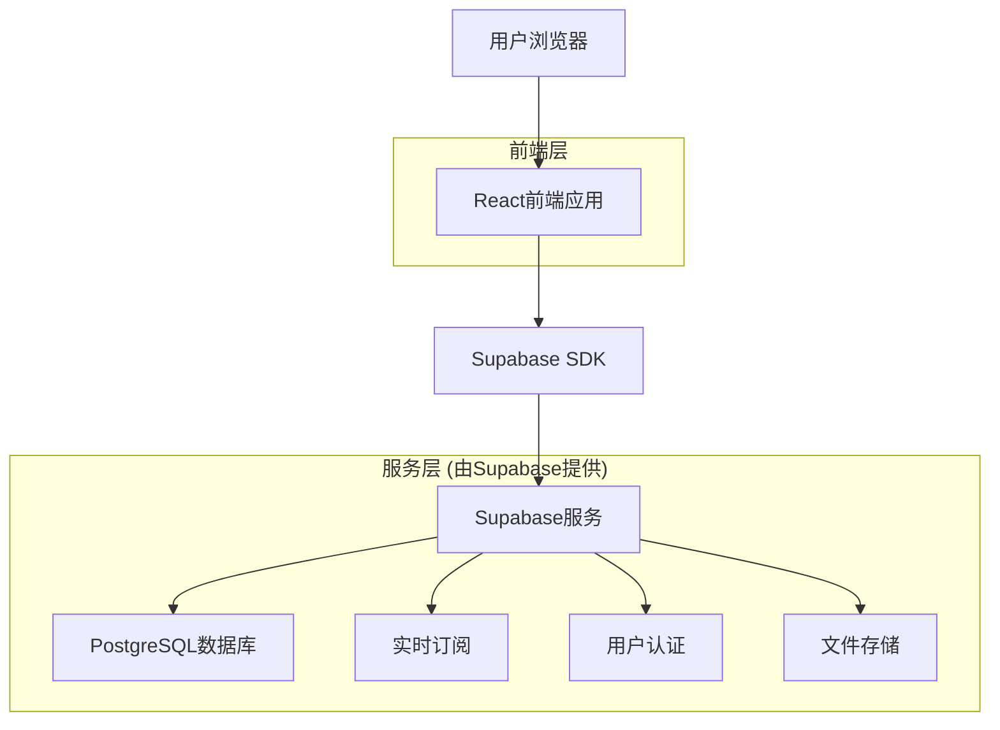
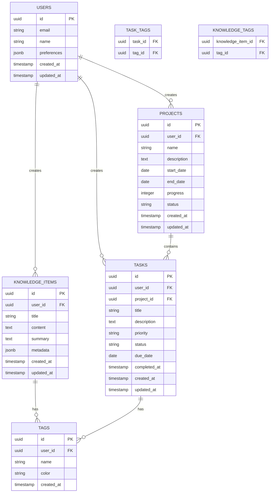

# 个人学习TodoList技术架构文档

## 1. Architecture design



## 2. Technology Description

* 前端: React\@18 + TypeScript + Tailwind CSS + Vite

* 后端: Supabase (提供数据库、认证、实时功能)

* 状态管理: Zustand

* UI组件库: Headless UI + Heroicons

* 图表库: Chart.js

* 富文本编辑: TipTap

## 3. Route definitions

| Route      | Purpose              |
| ---------- | -------------------- |
| /          | 主页面，显示任务概览、快速添加和统计面板 |
| /tasks     | 任务管理页面，管理所有任务和分类筛选   |
| /knowledge | 知识库页面，记录和管理知识点       |
| /projects  | 项目追踪页面，管理学习项目和进度     |
| /analytics | 统计分析页面，查看学习数据和分析报告   |
| /settings  | 设置页面，个人偏好和应用配置       |

## 4. API definitions

### 4.1 Core API

由于使用Supabase作为后端服务，主要通过Supabase客户端SDK进行数据操作，无需自定义API端点。主要数据操作包括：

**任务管理**

* 创建任务: `supabase.from('tasks').insert()`

* 更新任务: `supabase.from('tasks').update()`

* 删除任务: `supabase.from('tasks').delete()`

* 查询任务: `supabase.from('tasks').select()`

**知识点管理**

* 创建知识点: `supabase.from('knowledge_items').insert()`

* 更新知识点: `supabase.from('knowledge_items').update()`

* 搜索知识点: `supabase.from('knowledge_items').textSearch()`

**项目管理**

* 创建项目: `supabase.from('projects').insert()`

* 更新进度: `supabase.from('projects').update()`

* 查询项目统计: `supabase.rpc('get_project_stats')`

## 5. Data model

### 5.1 Data model definition



### 5.2 Data Definition Language

**用户表 (users)**

```sql
-- 用户表由Supabase Auth自动管理，扩展用户配置表
CREATE TABLE user_profiles (
    id UUID PRIMARY KEY REFERENCES auth.users(id) ON DELETE CASCADE,
    name VARCHAR(100) NOT NULL,
    preferences JSONB DEFAULT '{}',
    timezone VARCHAR(50) DEFAULT 'Asia/Shanghai',
    created_at TIMESTAMP WITH TIME ZONE DEFAULT NOW(),
    updated_at TIMESTAMP WITH TIME ZONE DEFAULT NOW()
);

-- 启用RLS
ALTER TABLE user_profiles ENABLE ROW LEVEL SECURITY;

-- 创建策略
CREATE POLICY "用户只能访问自己的配置" ON user_profiles
    FOR ALL USING (auth.uid() = id);
```

**任务表 (tasks)**

```sql
CREATE TABLE tasks (
    id UUID PRIMARY KEY DEFAULT gen_random_uuid(),
    user_id UUID NOT NULL REFERENCES auth.users(id) ON DELETE CASCADE,
    project_id UUID REFERENCES projects(id) ON DELETE SET NULL,
    title VARCHAR(200) NOT NULL,
    description TEXT,
    priority VARCHAR(20) DEFAULT 'medium' CHECK (priority IN ('low', 'medium', 'high', 'urgent')),
    status VARCHAR(20) DEFAULT 'pending' CHECK (status IN ('pending', 'in_progress', 'completed', 'cancelled')),
    due_date DATE,
    completed_at TIMESTAMP WITH TIME ZONE,
    created_at TIMESTAMP WITH TIME ZONE DEFAULT NOW(),
    updated_at TIMESTAMP WITH TIME ZONE DEFAULT NOW()
);

-- 创建索引
CREATE INDEX idx_tasks_user_id ON tasks(user_id);
CREATE INDEX idx_tasks_status ON tasks(status);
CREATE INDEX idx_tasks_due_date ON tasks(due_date);
CREATE INDEX idx_tasks_created_at ON tasks(created_at DESC);

-- 启用RLS
ALTER TABLE tasks ENABLE ROW LEVEL SECURITY;

-- 创建策略
CREATE POLICY "用户只能访问自己的任务" ON tasks
    FOR ALL USING (auth.uid() = user_id);

-- 授权
GRANT SELECT ON tasks TO anon;
GRANT ALL PRIVILEGES ON tasks TO authenticated;
```

**知识点表 (knowledge\_items)**

```sql
CREATE TABLE knowledge_items (
    id UUID PRIMARY KEY DEFAULT gen_random_uuid(),
    user_id UUID NOT NULL REFERENCES auth.users(id) ON DELETE CASCADE,
    title VARCHAR(200) NOT NULL,
    content TEXT NOT NULL,
    summary TEXT,
    metadata JSONB DEFAULT '{}',
    created_at TIMESTAMP WITH TIME ZONE DEFAULT NOW(),
    updated_at TIMESTAMP WITH TIME ZONE DEFAULT NOW()
);

-- 创建全文搜索索引
CREATE INDEX idx_knowledge_items_search ON knowledge_items 
    USING gin(to_tsvector('chinese', title || ' ' || content));
CREATE INDEX idx_knowledge_items_user_id ON knowledge_items(user_id);
CREATE INDEX idx_knowledge_items_created_at ON knowledge_items(created_at DESC);

-- 启用RLS
ALTER TABLE knowledge_items ENABLE ROW LEVEL SECURITY;

-- 创建策略
CREATE POLICY "用户只能访问自己的知识点" ON knowledge_items
    FOR ALL USING (auth.uid() = user_id);

-- 授权
GRANT SELECT ON knowledge_items TO anon;
GRANT ALL PRIVILEGES ON knowledge_items TO authenticated;
```

**项目表 (projects)**

```sql
CREATE TABLE projects (
    id UUID PRIMARY KEY DEFAULT gen_random_uuid(),
    user_id UUID NOT NULL REFERENCES auth.users(id) ON DELETE CASCADE,
    name VARCHAR(200) NOT NULL,
    description TEXT,
    start_date DATE,
    end_date DATE,
    progress INTEGER DEFAULT 0 CHECK (progress >= 0 AND progress <= 100),
    status VARCHAR(20) DEFAULT 'active' CHECK (status IN ('planning', 'active', 'completed', 'paused', 'cancelled')),
    created_at TIMESTAMP WITH TIME ZONE DEFAULT NOW(),
    updated_at TIMESTAMP WITH TIME ZONE DEFAULT NOW()
);

-- 创建索引
CREATE INDEX idx_projects_user_id ON projects(user_id);
CREATE INDEX idx_projects_status ON projects(status);
CREATE INDEX idx_projects_end_date ON projects(end_date);

-- 启用RLS
ALTER TABLE projects ENABLE ROW LEVEL SECURITY;

-- 创建策略
CREATE POLICY "用户只能访问自己的项目" ON projects
    FOR ALL USING (auth.uid() = user_id);

-- 授权
GRANT SELECT ON projects TO anon;
GRANT ALL PRIVILEGES ON projects TO authenticated;
```

**标签表 (tags)**

```sql
CREATE TABLE tags (
    id UUID PRIMARY KEY DEFAULT gen_random_uuid(),
    user_id UUID NOT NULL REFERENCES auth.users(id) ON DELETE CASCADE,
    name VARCHAR(50) NOT NULL,
    color VARCHAR(7) DEFAULT '#3b82f6',
    created_at TIMESTAMP WITH TIME ZONE DEFAULT NOW(),
    UNIQUE(user_id, name)
);

-- 任务标签关联表
CREATE TABLE task_tags (
    task_id UUID REFERENCES tasks(id) ON DELETE CASCADE,
    tag_id UUID REFERENCES tags(id) ON DELETE CASCADE,
    PRIMARY KEY (task_id, tag_id)
);

-- 知识点标签关联表
CREATE TABLE knowledge_tags (
    knowledge_item_id UUID REFERENCES knowledge_items(id) ON DELETE CASCADE,
    tag_id UUID REFERENCES tags(id) ON DELETE CASCADE,
    PRIMARY KEY (knowledge_item_id, tag_id)
);

-- 启用RLS
ALTER TABLE tags ENABLE ROW LEVEL SECURITY;
ALTER TABLE task_tags ENABLE ROW LEVEL SECURITY;
ALTER TABLE knowledge_tags ENABLE ROW LEVEL SECURITY;

-- 创建策略
CREATE POLICY "用户只能访问自己的标签" ON tags
    FOR ALL USING (auth.uid() = user_id);

CREATE POLICY "用户只能访问自己的任务标签" ON task_tags
    FOR ALL USING (auth.uid() IN (
        SELECT user_id FROM tasks WHERE id = task_id
    ));

CREATE POLICY "用户只能访问自己的知识点标签" ON knowledge_tags
    FOR ALL USING (auth.uid() IN (
        SELECT user_id FROM knowledge_items WHERE id = knowledge_item_id
    ));

-- 授权
GRANT ALL PRIVILEGES ON tags TO authenticated;
GRANT ALL PRIVILEGES ON task_tags TO authenticated;
GRANT ALL PRIVILEGES ON knowledge_tags TO authenticated;
```

**初始化数据**

```sql
-- 创建触发器函数更新updated_at字段
CREATE OR REPLACE FUNCTION update_updated_at_column()
RETURNS TRIGGER AS $$
BEGIN
    NEW.updated_at = NOW();
    RETURN NEW;
END;
$$ language 'plpgsql';

-- 为相关表添加更新时间触发器
CREATE TRIGGER update_user_profiles_updated_at BEFORE UPDATE ON user_profiles
    FOR EACH ROW EXECUTE FUNCTION update_updated_at_column();

CREATE TRIGGER update_tasks_updated_at BEFORE UPDATE ON tasks
    FOR EACH ROW EXECUTE FUNCTION update_updated_at_column();

CREATE TRIGGER update_knowledge_items_updated_at BEFORE UPDATE ON knowledge_items
    FOR EACH ROW EXECUTE FUNCTION update_updated_at_column();

CREATE TRIGGER update_projects_updated_at BEFORE UPDATE ON projects
    FOR EACH ROW EXECUTE FUNCTION update_updated_at_column();
```

